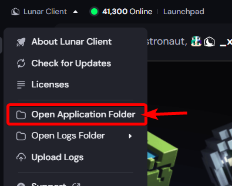

# CoffeeClient


 *A non injection-based Lunar Client QOL Client*

The way it works in Lunar is simple. Lunar allows 3rd party mod replacements in their "1.8.9 Forge" version. If you compile a 3rd party mod with your own code (shimming) Lunar still loads it since it contains the core classes.

For documentation of how this works, I suggest reading the archived copy of Lunar Client's documentation, located [here](https://web.archive.org/web/20260221030830/https://support.lunarclient.com/support/solutions/articles/60000752051-third-party-mods) or dm me on discord. `@axle.coffee`

## Community

We have a discord! [located here](https://discord.gg/4umJGqwftc)

# Tutorial

*this tutorial assumes you are somewhat tech literate, you can always ask ChatGPT for help*

To install, you will need 2 mods `ReplayMod-v1_8-2.6.14.jar` and `coffeeclient-1.0.0.coffeeclient.jar`

### Step 1

Navigate to Lunar Client's menu as seen here

On windows, this will drop you into the `.lunarclient` folder, MacOS and Linux should be similar.

### Step 2

Open `.lunarclient/offline/multiver/overrides`

Place ``ReplayMod-v1_8-2.6.14.jar`` (it must be named this perfectly, no (1) etc) here.

### Step 3

Navigate up 1 directory `.lunarclient/offline/multiver/overrides` and open `coffeeloader` folder
**NOTE:** you may not have this folder if you haven't launched yet, you can make the folder with the name `coffeeloader` just fine

This will contain your coffee mods folder (aka a `mods` folder), enter this folder and place the `coffeeclient-1.0.0.coffeeclient.jar` jar file in it

the final paths should be (for windows)
`C:\Users\%USER%\.lunarclient\offline\multiver\coffeeloader\mods\coffeeclient-1.0.0.coffeeclient.jar`
and
`C:\Users\%USER%\.lunarclient\offline\multiver\overrides\ReplayMod-v1_8-2.6.14.jar`

## Using 

CoffeeClient uses a command-based syntax, therefore, there is **NO** gui.

run `.coffee` to see commands

e.g. `.killaura horizontal-speed 5` `.config save` `.config load meow`

## Recent Changes

Recently, Lunar Client removed NotEnoughUpdates (as it was EOL and SkyBlock has blocked 1.8.9 for months now) - this means I had to rewrite everything to use a different host, my choice, replaymod.

However, due to the fact it makes 0 sense to keep writing code into an already heavy codebase, CoffeeClient will now use its own mod loader, making replaymod simply a loader of CoffeeClient, rather than containing coffeeclient itself

### Mixins

As long as you compile mixins to the FQDN of whatever mod you're cosplaying as (in this case, replaymod, or formerly, NotEnoughUpdates) example:

```kotlin
    // Relocate mixin classes into replaymod's mixin package so the framework's package prefix prepend produces the correct FQCN at runtime.
    relocate("$baseGroup.mixin", "com.replaymod.replay.mixin.$modid")

    fun relocate(name: String) = relocate(name, "$baseGroup.deps.$name")
```

you can essentially have full mixin support! **HOWEVER** Lunar Client runs their Forge 1.8.9 instance on **Java 17** meaning if you try to use specific java 8 methods, they likely may not work. this goes for mixins and normal "mod" code

### Modding

I have a simple init system for "CoffeeMods"

```java
@CoffeeMod(name = "ExampleMod", version = "1.0.0") //basically forge info
public class ExampleMod {

    @CoffeeMod.EventHandler
// LunarClient's mixin init event, only place you can probably tamper with Lunar itself, if you wanted to do that, since even "Lunar" isn't fully loaded
    public void onMixinInit(CLMixinInitEvent event) {
        Logger.info("[ExampleMod] Mixin init ----- "
                + event.getLoadedMods() + " mod(s), "
                + event.getRegisteredMixins() + " mixin(s)");
    }

    @CoffeeMod.EventHandler
// I think this was renamed to earlyinit?
// This is the exact static hook Lunar Client calls to invoke whatever mod you've shimmed CoffeeClient's loader to - Lunar client doesnt risk loading a mod via normal forge, so we actually gain an entry point
    public void onNEUInit(CLNEUInitEvent event) {
        Logger.info("[ExampleMod] Early init");
    }

    @CoffeeMod.EventHandler
// Forge PreInit - parsed by Lunar
    public void onPreInit(CLPreInitEvent event) {
        Logger.info("[ExampleMod] Pre-init");
    }

    @CoffeeMod.EventHandler
// same as above
    public void onInit(CLInitEvent event) {
        Logger.info("[ExampleMod] Init");
        Logger.info("[ExampleMod] MC version: " + Minecraft.getMinecraft().getVersion());
    }

    @CoffeeMod.EventHandler
// same as above
    public void onPostInit(CLPostInitEvent event) {
        Logger.info("[ExampleMod] Post-init --- meowwww");
    }
}
```

# License

I am a catboy; therefore, everything is open source. Feel free to skid this 52 different times, I really don't care. If it breaks dm me on discord - @axle.coffee or open a github issue or fix it yourself and open a PR MY code is licensed under MIT

If there is any code that can't be distributed under an MIT license, please message me on discord or open an issue or whatever.
